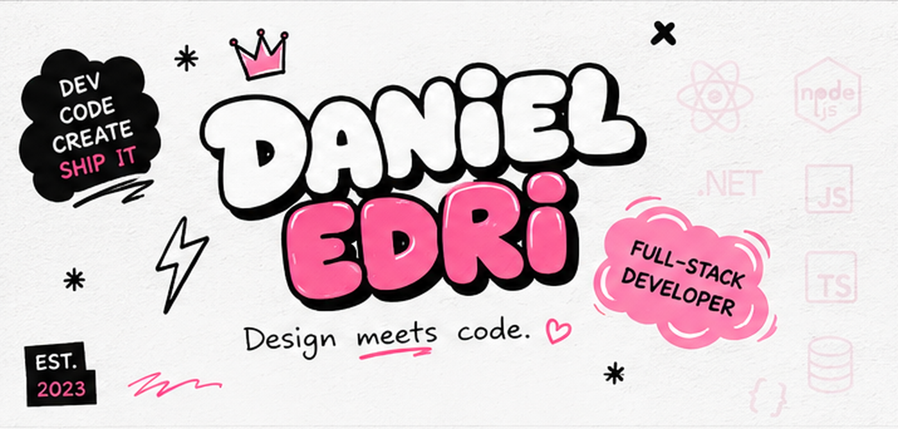
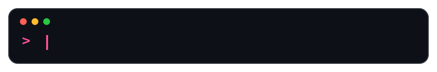

<!--
  Daniel Edri — GitHub Profile README
  Repository: GoofyGoose1/GoofyGoose1

  Required assets:
  assets/graffiti-header.png
  assets/typing-terminal.svg
  assets/coding-wave.svg
  assets/animated-footer.svg
-->

<div align="center">



[](https://github.com/GoofyGoose1)
[](https://github.com/GoofyGoose1?tab=followers)
[](https://github.com/GoofyGoose1)

<br><br>



</div>

<br>

## `> WHOAMI`

```javascript
const daniel = {
  role: "Junior Full-Stack Developer",

  frontend: [
    "React",
    "Next.js",
    "TypeScript",
    "JavaScript",
    "Tailwind CSS"
  ],

  backend: [
    "Node.js",
    "Express",
    "C#",
    ".NET",
    "SQL",
    "Python"
  ],

  mission: [
    "Build useful software",
    "that works well",
    "and feels great to use"
  ].join(" ")
};
```

### `ABOUT_ME`

I enjoy the point where **design meets code**.

I build modern interfaces and the backend systems that support them. I care about clean structure, smooth user experiences, and products people genuinely enjoy using.

- 💗 Building responsive full-stack applications
- ✦ Improving TypeScript, Next.js, and architecture skills
- ✦ Exploring UI systems, animations, and micro-interactions
- ✦ Expanding backend experience with APIs and databases
- ✦ Open to collaborations and practical projects

</td>
</tr>
</table>

<br>

## `> TECH_STACK`

<div align="center">


</div>

<br>

### `FRONTEND`

React · Next.js  
JavaScript · TypeScript  
HTML · CSS · Tailwind CSS  

<br>

### `BACKEND`

Node.js · Express  
C# · .NET · Python  
REST APIs · SQL  

<br>

### `TOOLS`

Git · GitHub · VS Code  
Figma · GitHub Actions  
Responsive UI · UX

</td>
</tr>
</table>

<br>

## `> CURRENT_STATUS`

```text
BUILDING    Responsive web applications and reusable UI components
LEARNING    TypeScript, Next.js and full-stack architecture
IMPROVING   API design, database structure and maintainable code
EXPLORING   Motion, interaction design and modern visual systems
```

<div align="center">


</div>

<br>

## `> FEATURED_PROJECTS`

<table>
<tr>
<td align="center" width="50%">
<a href="https://github.com/GoofyGoose1/DressLily">

</a>

### DressLily

</td>

<td align="center" width="50%">
<a href="https://github.com/GoofyGoose1/Portfolio">

</a>

### Portfolio

</td>
</tr>

<tr>
<td align="center">
<a href="https://github.com/GoofyGoose1/StepUp">

</a>

### StepUp

</td>

<td align="center">
<a href="https://github.com/GoofyGoose1/RagPro">

</a>

### RagPro

</td>
</tr>
</table>

</div>

<br>

## `> CONTRIBUTIONS`

<div align="center">


</div>
<br>

## `> CONTRIBUTION_STREAK`

<div align="center">


</div>
<br>

## `> CONTRIBUTION_SNAKE`

<div align="center">

<picture>
  <source
    media="(prefers-color-scheme: dark)"
    srcset="https://raw.githubusercontent.com/GoofyGoose1/GoofyGoose1/output/github-contribution-grid-snake-dark.svg"
  />

  <source
    media="(prefers-color-scheme: light)"
    srcset="https://raw.githubusercontent.com/GoofyGoose1/GoofyGoose1/output/github-contribution-grid-snake.svg"
  />

  
</picture>
</div>
<br>

## `> PRINCIPLES.TXT`

```text
01. Solve the real problem.
02. Make the solution work.
03. Make the code understandable.
04. Make the experience responsive.
05. Make the system maintainable.
06. Then make it beautiful.
```

<br>

## `> CONNECT --WITH-DANIEL`

<div align="center">

[](https://www.linkedin.com/in/danieledri-/)
[](mailto:edridaniel2002@gmail.com)
[](https://github.com/GoofyGoose1)

<br><br>


</div>
