<!--
  Daniel Edri — GitHub Profile README
  Repository name must be exactly: GoofyGoose1
  Replace the contact links near the bottom with your real details.
-->

<div align="center">
  
</div>

<div align="center">

[](https://github.com/GoofyGoose1)
[](https://github.com/GoofyGoose1?tab=followers)
[](https://github.com/GoofyGoose1?tab=repositories)

</div>

<br>

<div align="center">
  
</div>

## `> about_me.exe`

```javascript
const daniel = {
  role: "Junior Full-Stack Developer",
  focus: ["Frontend Development", "UI/UX", "Responsive Web Apps"],
  buildingWith: ["React", "JavaScript", "TypeScript", "Node.js"],
  backendTools: ["C#", ".NET", "SQL", "Python"],
  currentMission: "Turn useful ideas into fast, clean and enjoyable products",
  mindset: "Learn. Build. Break. Improve. Repeat."
};
```

I enjoy the point where **design meets code**. My main focus is building modern interfaces that feel intuitive, respond smoothly, and work well on every screen. I am also expanding my backend knowledge so I can take products from an idea to a complete full-stack application.

- 🔭 Building responsive React and full-stack projects
- 🌱 Improving my TypeScript, Next.js and software architecture skills
- 🎨 Interested in UI systems, animations and polished user experiences
- 🤝 Open to collaborating on practical web applications
- ⚡ I care about both how a product works and how it feels to use

<br>

## `> tech_stack --show-icons`

<div align="center">
  
</div>

<br>

<table align="center">
  <tr>
    <td align="center" width="33%">
      <strong>Frontend</strong><br><br>
      React · JavaScript · TypeScript<br>
      HTML · CSS · Tailwind
    </td>
    <td align="center" width="33%">
      <strong>Backend</strong><br><br>
      Node.js · Express · C#<br>
      .NET · Python · REST APIs
    </td>
    <td align="center" width="33%">
      <strong>Tools & Design</strong><br><br>
      Git · GitHub · VS Code<br>
      Figma · Responsive Design
    </td>
  </tr>
</table>

<br>

## `> github_dashboard --live`

<div align="center">
  <picture>
    <source
      srcset="https://github-readme-stats.vercel.app/api?username=GoofyGoose1&show_icons=true&hide_border=true&bg_color=0d1117&title_color=00d9ff&icon_color=7c3aed&text_color=c9d1d9&ring_color=ec4899&include_all_commits=true&rank_icon=github"
      media="(prefers-color-scheme: dark)"
    />
    
  </picture>
  <picture>
    <source
      srcset="https://github-readme-stats.vercel.app/api/top-langs/?username=GoofyGoose1&layout=compact&hide_border=true&bg_color=0d1117&title_color=00d9ff&text_color=c9d1d9&langs_count=8"
      media="(prefers-color-scheme: dark)"
    />
    
  </picture>
</div>

<br>

<div align="center">
  <picture>
    <source
      srcset="https://streak-stats.demolab.com?user=GoofyGoose1&hide_border=true&background=0D1117&stroke=30363D&ring=00D9FF&fire=EC4899&currStreakNum=FFFFFF&sideNums=C9D1D9&currStreakLabel=00D9FF&sideLabels=8B949E&dates=8B949E"
      media="(prefers-color-scheme: dark)"
    />
    
  </picture>
</div>

> GitHub's public statistics services occasionally hit rate limits. The cards normally return automatically after the service cache refreshes.

<br>

## `> contribution_activity --animate`

<div align="center">
  <picture>
    <source
      media="(prefers-color-scheme: dark)"
      srcset="https://github-readme-activity-graph.vercel.app/graph?username=GoofyGoose1&bg_color=0d1117&color=c9d1d9&line=00d9ff&point=ec4899&area=true&hide_border=true"
    />
    
  </picture>
</div>

<br>

## `> run contribution_snake`

<div align="center">
  <picture>
    <source
      media="(prefers-color-scheme: dark)"
      srcset="https://raw.githubusercontent.com/GoofyGoose1/GoofyGoose1/output/github-contribution-grid-snake-dark.svg"
    />
    <source
      media="(prefers-color-scheme: light)"
      srcset="https://raw.githubusercontent.com/GoofyGoose1/GoofyGoose1/output/github-contribution-grid-snake.svg"
    />
    
  </picture>
</div>

<details>
  <summary><strong>Snake not visible yet?</strong></summary>
  <br>

  1. Keep the included file at <code>.github/workflows/snake.yml</code>.
  2. Open the repository's <strong>Actions</strong> tab.
  3. Run <strong>Generate contribution snake</strong>.
  4. Make sure Actions has permission to write to the repository.
  5. Refresh your profile after the workflow creates the <code>output</code> branch.

</details>

<br>

## `> current_focus.json`

```json
{
  "frontend": "Reusable React components and smooth responsive layouts",
  "backend": "Reliable APIs, clean data flow and database fundamentals",
  "quality": "Readable code, useful naming and maintainable structure",
  "design": "Interfaces that are clear before they are impressive",
  "next": "TypeScript, Next.js and deeper full-stack architecture"
}
```

<br>

## `> project_pipeline`

<table>
  <tr>
    <td width="50%" valign="top">
      <h3>🌐 Frontend Experiences</h3>
      <p>Responsive interfaces, component systems, animations and accessible user flows.</p>
      <p><strong>Typical stack:</strong> React · TypeScript · Tailwind</p>
    </td>
    <td width="50%" valign="top">
      <h3>⚙️ Full-Stack Applications</h3>
      <p>Web applications that connect polished frontends with APIs and databases.</p>
      <p><strong>Typical stack:</strong> React · Node.js/.NET · SQL</p>
    </td>
  </tr>
  <tr>
    <td width="50%" valign="top">
      <h3>🎨 UI Experiments</h3>
      <p>Small projects exploring layouts, micro-interactions and modern visual styles.</p>
      <p><strong>Focus:</strong> UX · Motion · Responsive Design</p>
    </td>
    <td width="50%" valign="top">
      <h3>🧰 Developer Tools</h3>
      <p>Scripts and utilities that automate repetitive work or simplify a workflow.</p>
      <p><strong>Typical stack:</strong> Python · JavaScript · GitHub Actions</p>
    </td>
  </tr>
</table>

<!--
  Replace the section above with real project cards when your repositories are ready.

  Example:
  <a href="https://github.com/GoofyGoose1/REPOSITORY_NAME">
    
  </a>
-->

<br>

## `> principles.md`

```text
01. Make it work.
02. Make it clear.
03. Make it responsive.
04. Make it maintainable.
05. Then make it beautiful.
```

<br>

## `> connect --with-daniel`

<div align="center">

<!-- Replace YOUR_LINKEDIN_USERNAME and YOUR_EMAIL_ADDRESS -->

[](https://www.linkedin.com/in/YOUR_LINKEDIN_USERNAME/)
[](mailto:YOUR_EMAIL_ADDRESS)
[](https://github.com/GoofyGoose1)

</div>

<br>

<div align="center">

```text
Thanks for visiting.
Build something useful today.
```

  
</div>
